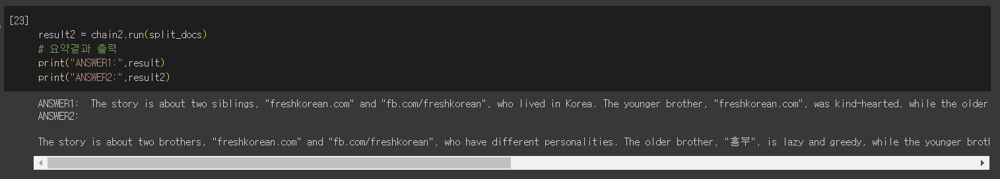

# LANGCHAIN PDF 문서 요약 AI오픈소스 201911977_이세훈😿

허깅페이스 llm모델을 이용하여 PDF 문서 요약을 하는 실습을 진행했습니다.

이번 PDF 요약은 맵-리듀스방법과 load_summarize_chain방법의 결과 차이를 알아보기 위해 두 방법 모두 진행했습니다.
맵-리듀스방법은 LLM 체인을 각 문서에 개별적으로 적용하고(맵 단계) 체인 출력을 새 문서로 처리합니다. 그런 다음 모든 새 문서를 별도의 결합 문서 체인에 전달하여 단일 출력을 얻습니다(축소 단계).

사용한 모델은 "mistralai/Mistral-7B-Instruct-v0.1" 아래 허깅페이스 사이트에 올라온 모델을 이용했습니다.(한국어도 가능)
https://huggingface.co/mistralai/Mistral-7B-Instruct-v0.1

사용한 PDF문서는 저작권?의 문제가 발생할 수 있어 올리지 않았습니다.

# 결과 사진

기존 블로그 예제 코드에서 document[0]으로 PDF파일의 1페이지만 불러오던 것을 
수정해 전체 PDF파일을 불러오게 바꿨습니다.

맵-리듀스방법과 load_summarize_chain방법의 요약 차이를 알기 위해서 2가지 체인을 생성했습니다.

## 실행 방법
1. 허깅페이스 토큰 설정
2. tale.pdf위치에 원하는 pdf파일 설정
3. ipynb파일 모두 실행
